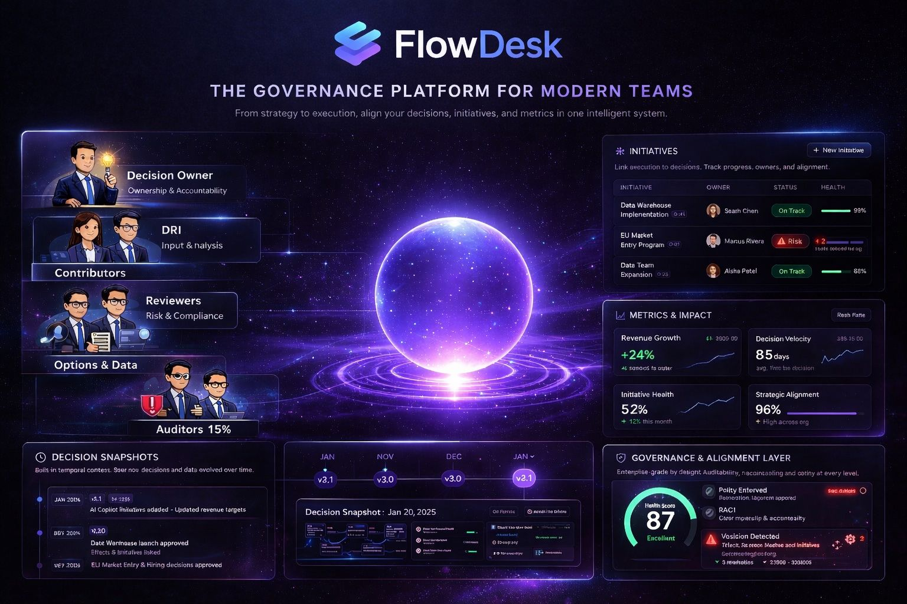
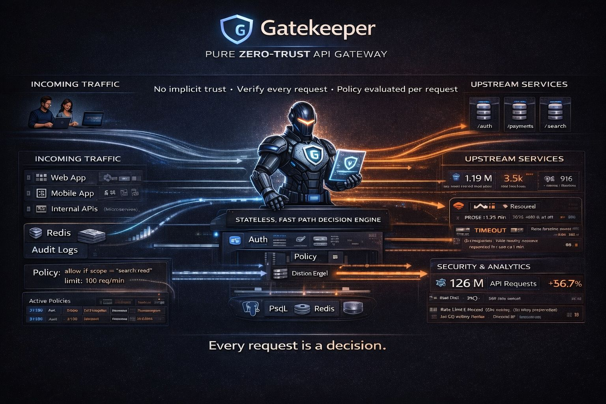
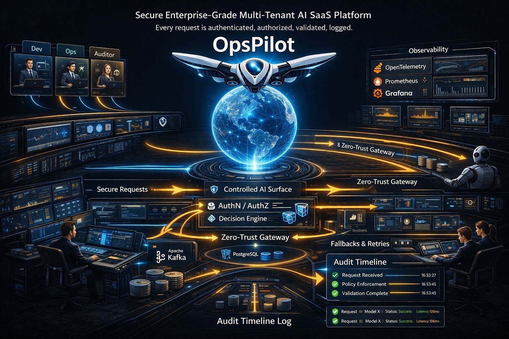

## Software Engineer | Architecture • TypeScript • Distributed Systems

I design, build, and own **production-grade platforms** focused on **security, governance, and long-term system reliability**.

🌍 Remote & international (US, UK, EU)

---

### Executive Summary

I design and own production-grade platforms that prevent organizations from repeating the same mistakes — 
by turning architecture, security, and decision-making into long-lived system primitives.

---

### TL;DR
I build systems that help organizations **make better decisions at scale**, by treating architecture, security, and governance as **first-class engineering problems**.

---

### 🧩 Selected Work

The projects below reflect how I approach system design: from organizational decision-making, to platform foundations, to AI-driven internal tooling.

---

<table>
  <tr>
    <td align="center" width="33%">
      
      <h1>FlowDesk</h1>
      <h3>📌Decision Intelligence & Governance Platform</h3>
      <i>FlowDesk is a full-stack decision governance platform that systematically captures, structures, audits, and evolves high-impact decisions, institutionalizing decision traceability across organizations</i>
       
      <h4>🔓 Access the System (Code & Live Environment)</h4>
      📦 <strong><a href="https://github.com/louismarcel90/FlowDesk">Repository</a> | ▶️ <a href="REPO_LINK_1">Live Demo</a></strong>
       
      <strong>Tags:</strong> Governance, Ownership, Security
    </td>
    <td align="center" width="33%">
      
      <h1>Gatekeeper</h1>
      <h3>📌Zero-Trust API Gateway & Management Platform</h3>
      <i>Gatekeeper is a full-stack API security and governance platform built to address today’s most urgent enterprise needs: access control, rate limiting, auditability, analytics, and abuse prevention</i>
       
      <h4>🔓 Access the System (Code & Live Environment)</h4>
      📦 <strong><a href="https://github.com/louismarcel90/Gatekeeper">Repository</a> | ▶️ <a href="REPO_LINK_1">Live Demo</a></strong>
       
      <strong>Tags:</strong> API, Security, Observability
    </td>
    <td align="center" width="33%">
      
      <h1>OpsPilot AI</h1>
      <h3>📌Enterprise-Grade AI SaaS Platform</h3>
      <i>OpsPilot AI is a secure, audit-ready SaaS platform designed to demonstrate how AI can be safely embedded into enterprise operations, focusing on governance, scalability, and compliance</i>
       
      <h4>🔓 Access the System (Code & Live Environment)</h4>
      📦 <strong><a href="REPO_LINK_1">Repository</a> | ▶️ <a href="REPO_LINK_1">Live Demo</a></strong>
       
      <strong>Tags:</strong> Governance, Scalability, Compliance
    </td>
  </tr>
</table>

---

### 🛡️ Scope of Responsibility

I operate at Staff / Principal level scope, focusing on :

- Cross-team architectural alignment through clear system boundaries and long-lived API contracts
- Security, governance, and failure modes treated as first-class, design-time concerns
- Multiplying team impact via standards, design reviews, and technical direction

---

### 🎯 Engineering Impact

I operate at the intersection of **systems, people, and product** to deliver platforms that scale reliably over time.

- Set technical direction for **production-grade systems** with long-lived APIs and clear domain boundaries
- Drive architectural decisions balancing **delivery speed, scalability, and evolvability**
- Multiply impact through design reviews, standards, and mentorship

**What teams get :**
- Fewer regressions and architectural drift
- Better decision traceability and accountability
- Systems that scale with both traffic *and* organization size

---

### 📊 Measurable Outcomes

While these projects are independent initiatives, they are designed to mirror real-world scale and constraints:

- Designed auditable decision workflows supporting 100+ concurrent records across multiple ownership domains  
- Simulated multi-team environments (5–10 teams) with clear responsibility boundaries and access control  
- Architectures validated against real failure modes, ensuring multi-year data integrity, safe rollbacks, and schema evolution  

---

### 🧭 How to Read This Profile

This GitHub profile is intentionally structured to reflect how I approach real-world system design.

Each project aims to highlight:
- Thoughtful architectural trade-offs made under realistic constraints
- Ownership that goes beyond feature delivery, into long-term system health
- Systems designed for durability and reliability, not just short-term velocity

---

## 🏗️ Technical Foundations

- End-to-end web systems (React / Next.js, Node.js)
- Backend & API architecture (REST, Auth, Validation)
- Data modeling & performance (PostgreSQL, Redis, MongoDB)
- Production delivery (Docker, CI/CD, Cloud platforms)
- Testing strategies & system reliability
- AI-powered features (OpenAI APIs)

---

## 🧠 How I Think as an Engineer

- Architecture is a **product decision**
System boundaries and APIs shape scale, velocity, and long-term cost
- Security, governance, and observability are **first-class features**
Ownership and auditability are designed in, not added later
- I optimize for **long-term leverage**
Code changes. Architectural decisions compound

---

## 📬 Contact

- 💼 **LinkedIn :**  https://www.linkedin.com/in/louis-marcel-bonga-763904184
- ✉️ **Email :** didierbonga.a@gmail.com
