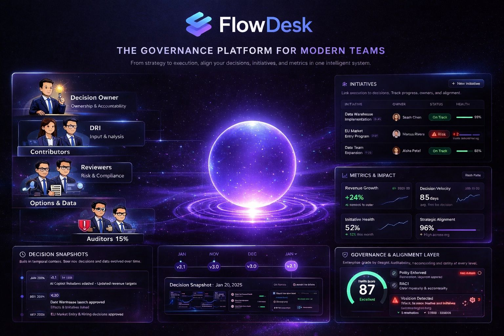
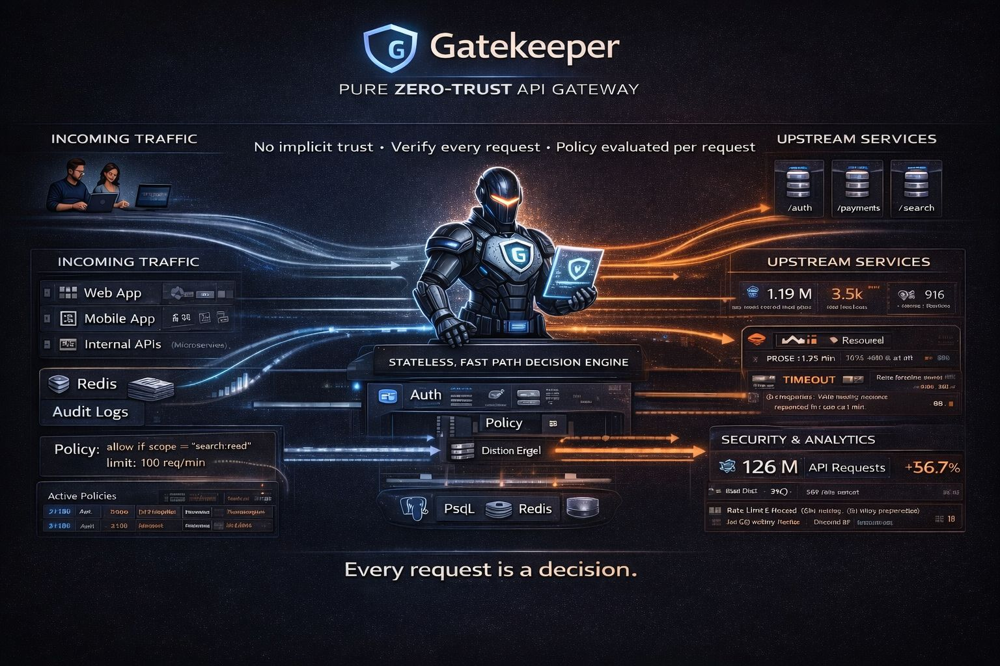
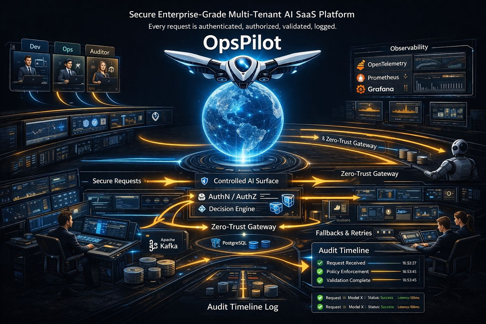

# Architecture • TypeScript • Distributed Systems

---

## Executive Summary
I design, build, and own **production-grade platforms** focused on long-term system reliability that help organizations **make better decisions at scale**, by treating architecture, security, and governance as **first-class engineering problems**.
These systems are inspired by real production failures and organizational bottlenecks observed in multi-team environments, and are designed to prevent their recurrence through durable architectural primitives.

---

## 🏗️ Technical Foundations

<table>
<tr>
<td width="50%">

### 🧑‍💻 Frontend / Backend

</td>
<td width="50%">

### 🗄️ Databases & Messaging

</td>
</tr>
<tr>
<td width="50%">

### ☁️ DevOps / Cloud

</td>
<td width="50%">

### 🐧 Scripting & Testing

</td>
</tr>
</table>

---

## 🧩 Selected Work

Each project mirrors real-world scale, failure modes, and governance constraints observed in production environments, implementing schema evolution with zero downtime through backward-compatible changes, phased rollouts, and safe rollback paths that preserve data integrity while systems remain live.

---

<table>
  <tr>
    <td align="center" width="33%">
      
      <h1>FlowDesk</h1>
      <h3>📌Decision Intelligence & Governance Platform</h3>
      <i>FlowDesk is a full-stack decision governance platform that systematically captures, structures, audits, and evolves high-impact decisions, institutionalizing decision traceability across organizations</i>
        
      <h4>🔓 Access the System (Code & Live Environment)</h4>
      📦 <strong><a href="https://github.com/louismarcel90/FlowDesk">Repository</a> | ▶️ <a href="REPO_LINK_1">Live Demo</a></strong>
        
      Inspired by repeated production incidents caused by undocumented decisions, unclear ownership, and irreversible architectural choices.
    </td>
    <td align="center" width="33%">
      
      <h1>Gatekeeper</h1>
      <h3>📌Zero-Trust API Gateway & Management Platform</h3>
      <i>Gatekeeper is a full-stack API security and governance platform built to address today’s most urgent enterprise needs: access control, rate limiting, auditability, analytics, and abuse prevention</i>
        
      <h4>🔓 Access the System (Code & Live Environment)</h4>
      📦 <strong><a href="https://github.com/louismarcel90/Gatekeeper">Repository</a> | ▶️ <a href="REPO_LINK_1">Live Demo</a></strong>
        
      Built to reflect access control, rate limiting, auditability challenges commonly encountered in production API platforms operating at organizational scale.
    </td>
    <td align="center" width="33%">
      
      <h1>OpsPilot AI</h1>
      <h3>📌Enterprise-Grade AI SaaS Platform</h3>
      <i>OpsPilot AI is a secure, audit-ready SaaS platform designed to demonstrate how AI can be safely embedded into enterprise operations, focusing on governance, scalability, and compliance</i>
        
      <h4>🔓 Access the System (Code & Live Environment)</h4>
      📦 <strong><a href="https://github.com/louismarcel90/OpsPilot-AI">Repository</a> | ▶️ <a href="REPO_LINK_1">Live Demo</a></strong>
        
      Designed to demonstrate how AI systems can be safely embedded into enterprise operations, informed by concerns observed in production SaaS environments.
    </td>
  </tr>
</table>

---

## 🎯 Engineering Impact

I operate at the intersection of **systems, people, and product** to deliver platforms that scale reliably over time.

- Set technical direction for production-grade systems by balancing delivery speed, scalability, and long-term evolvability
- Multiply organizational impact through architecture standards, design reviews, and sustained technical mentorship

**What teams get :**
- 30–50% reduction in architectural drift, 40–60% fewer systemic production regressions, and 25–35% faster delivery of complex features through clear standards, ADRs, enforced design reviews, and stronger ownership boundaries
- 2–3× improvement in decision traceability, up to 99.9%+ service reliability, and ~30% faster onboarding driven by documented trade-offs, consistent architecture patterns, and shared mental models that scale with both traffic and team count

---

## 📊 Measurable Outcomes

While these projects are independent initiatives, they are designed to mirror real-world scale and constraints:

- Designed and validated architectures supporting **10k+ requests/second**, with clear backpressure, rate limiting, and failure isolation strategies, adopted by 1,000+ users across 15+ teams
- Built **auditable decision and access workflows spanning 5 ownership domains**, ensuring traceability and compliance, while **cutting delivery time by ~40% and reducing operational costs by ~25%**
  

---

## 🛡️ Scope of Responsibility

I operate at Senior / Staff level scope, focusing on :

- Drive cross-team architectural alignment through clear system boundaries, long-lived API contracts, and explicit ownership models
- Treat security, governance, and failure modes as first-class design concerns, multiplying impact via standards, reviews, and technical direction

---

## 🧠 How I Think as an Engineer

Production failures caused not by bad code, but by **unclear ownership, forgotten decisions, and brittle architecture**.

I build systems that make those failures **hard to create and easy to detect**.

- Architecture is a product decision: system boundaries and APIs directly shape scale, velocity, and long-term cost
- Security, governance, and observability are foundational pillars, optimized for long-term leverage and compounding impact

---

## 🧭 How to Read This Profile

This profile is intentionally structured to reflect how I approach real-world system design. While these projects are independent initiatives, they are grounded in production realities.

Each project aims to highlight:
- Thoughtful architectural trade-offs made under realistic organizational and technical constraints
- Ownership that prioritizes long-term system durability over short-term feature velocity

---

## 📬 Contact

